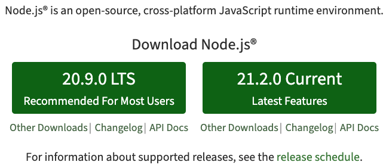
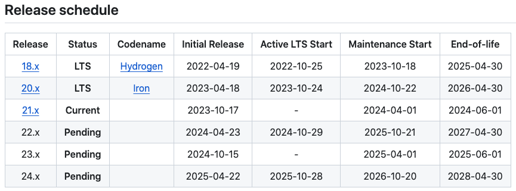
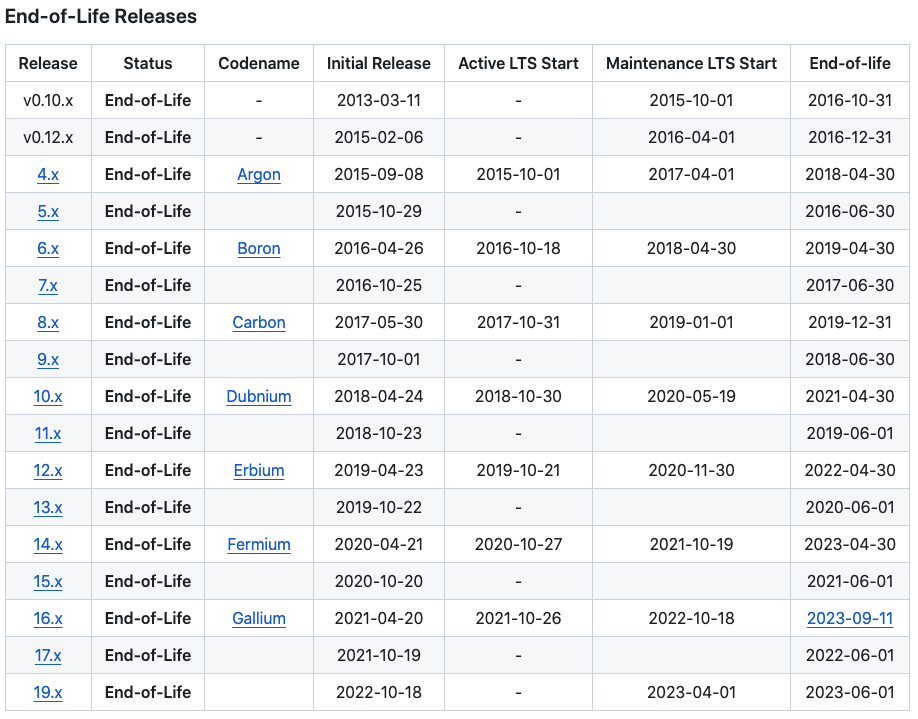

# Node的版本选择

常常有小伙伴问我应该选择哪个Node版本，在回答这个问题之前，我们需要先知道：
1. Node的版本规则
2. 每个版本的ChangeLog，即该版本做了哪些变动
3. 环境约束
4. 项目约束

掌握了以上4点，相信小伙伴们可以自己做出明智的选择！

## Node的版本规则

当我们进入Node官网时，看到的界面如下所示：



有2个选择：LTS版和Current版。
1. LTS版：LTS是Long-Term Support的缩写，即长期支持的版本。版本号为偶数，例如Node16、Node18、Node20等。**重点在于稳定和安全，有至少30个月的维护期，随后进入EOL(结束阶段)不再维护。** 通常在每年4月发布大版本。
2. Current版：即Node最新发布版本，包含最新特性和改进。版本号为奇数，例如Node17、Node19等。**重点在于最新特性支持，更新频率更快。** 通常每年10月发布大版本。

**除非追求新特性或实验目的，无论是日常开发使用还是生产环境，均推荐选择已经进入活跃阶段或维护阶段的LTS版。** 重点说明一下LTS版本的规律：通常情况下，4月发布，6个月后(同年10月份)成为LTS版，维护30个月后不再维护。重点关注以下2张表：(详细见参考链接2)

1. 版本规划表

    

2. 已经不再维护的版本表

    

## 版本ChangeLog

两种方法查看版本ChangeLog，一种是官网news，另一种则是github中维护的Changelog[见参考链接3]，以下整理了从node12~node20的LTS版:

| 版本 | LTS版 | 环境要求 | 特性 |
| :--- | :--- | :--- | :--- |
| node12 | >=v12.13.0 LTS | 1. Windows(arm64) >= Windows 10 <br> 2. macOS(x64) >= 10.11 <br> 3. 更多查看[BUILDING.md](https://github.com/nodejs/node/blob/v12.x/BUILDING.md#platform-list) | 1. V8引擎升级(7.2->7.4) <br> 2. 默认支持TLS1.3 <br> 3.更恰当的堆内存分配 <br> 4. 从http-parser迁移到llhttp <br> 5. 实验特性工作线程worker threads <br> 6. 实验特性诊断报告 <br> 7. 堆内存dump <br> 8. 启动速度改进 <br> 9. 实验特性ES6模块支持 |
| node14 | >=v14.15.0 LTS | 1. Windows(arm64) >= Windows 10 <br> 2. macOS(x64) >= 10.11 <br> 3. 更多查看[BUILDING.md](https://github.com/nodejs/node/blob/v14.x/BUILDING.md#platform-list) | 1. V8升级到8.1，支持Optional Chaining（可选链）、Nullish Coalescing（空值合并）、Top-Level Await（顶级 await 支持）等功能 <br> 2. 实验特性Async Local Storage（异步本地存储）<br> 3. 实验性 Web Assembly 系统接口 <br> 4. Diagnostic report（诊断报告）变得稳定<br> 5. Stream |
| node16 | >=v16.13.0 LTS | 1. Windows(arm64) >= Windows 10 <br> 2. macOS(x64) >= 10.13 <br> **3. gcc >= 8.3** <br> 4. 更多查看[BUILDING.md](https://github.com/nodejs/node/blob/v16.x/BUILDING.md#platform-list) | 1. V8升级到9.0 <br> 2. 稳定Timers Promises API <br> 3. 实现试验性的标准Web加密API <br> 3. npm7 <br> 4. NODE-API version 8 <br> 5. 支持 btoa/atob 与浏览器环境保持了一致 |
| node18 | >=v18.12.0 LTS | 1. Windows(arm64) >= Windows 10 <br> 2. macOS(x64) >= 10.15 <br> **3. gcc >=8.3** <br> 4. 更多查看[BUILDING.md](https://github.com/nodejs/node/blob/v18.x/BUILDING.md#platform-list) | 1. V8升级到10.1 <br> 2. 实验性Fetch API <br> 3. 实验性的test_runner,支持单元测试 |
| node20 | >=v20.9.0 LTS | 1. Windows(arm64) >= Windows 10 <br> 2. macOS(x64) >= 10.15 <br> **3. gcc >= 10.1** <br> 4. 更多查看[BUILDING.md](https://github.com/nodejs/node/blob/v20.x/BUILDING.md#platform-list) | 1. V8升级到11.3 <br> 2. 实验性的权限模型 <br> 3. 稳定的test_runner <br> 4. 同步import.meta.reslove，与浏览器行为保持了一致 <br> 5. 构建可执行的独立包 |

## 环境约束

在版本changelog章节中，列出了node12~node20的环境要求。值得注意的是，除了要关注自己本机的环境是否符合条件，请重点关注您项目生产构建发布的环境是否满足。

## 项目约束

所谓项目约束，是指您项目中的第三方依赖对node版本的要求，例如：

1. 显示的在package.json中标明：

    ```
    // package.json
    "engines": {
        "node": ">=16.13.0"
    },
    ```

    如果您的node版本不符合条件则会`yarn install`失败，虽然您可以通过`yarn install --ignore-engines`

2. 还有些依赖虽然没有显示的说明对node版本的依赖，但是在低版本中使用或构建会报错，也需要通过升级到更新的node版本来解决。

3. 像ESBuild、node-sass、node-gyp等依赖会根据node版本下载依赖的本地模块，如果无法安装也会导致项目安装失败(例如：内网环境)，`npm install --ignore-scripts` 可以解决在安装时无法下载本地模块的问题，但是会导致依赖无法正常使用，例如esbuild

# 总结

Node版本的选择：
1. 选择LTS版，通常每年10月发布的偶数版本，例如：>=v20.9.0 、>=v18.12.0 、>= v16.13.0。
2. 关注是否满足环境约束，查看目标版本的BUILDING.md
3. 关注项目的第三方依赖的node版本的要求

# 参考

[1. 官网release说明](https://nodejs.org/en/about/previous-releases)

[2. 在Github中维护的release-schedule](https://github.com/nodejs/release#release-schedule)

[3. 在Github中维护的ChangeLog](https://github.com/nodejs/node/tree/main/doc/changelogs)